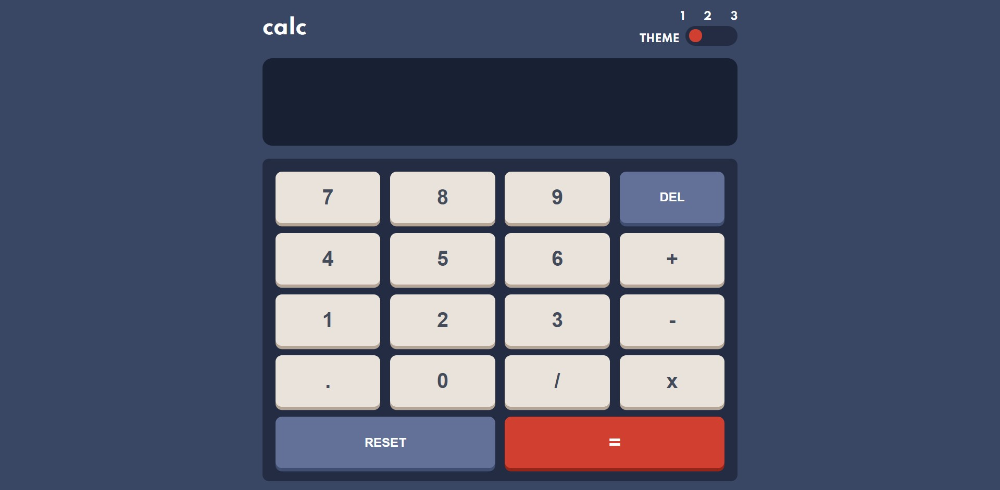

# Frontend Mentor - Calculator app solution

This is a solution to the [Calculator app challenge on Frontend Mentor](https://www.frontendmentor.io/challenges/calculator-app-9lteq5N29). Frontend Mentor challenges help you improve your coding skills by building realistic projects. 

## Table of contents

- [Overview](#overview)
  - [The challenge](#the-challenge)
  - [Screenshot](#screenshot)
  - [Links](#links)
- [My process](#my-process)
  - [Built with](#built-with)
  - [What I learned](#what-i-learned)
  - [Continued development](#continued-development)
  - [Useful resources](#useful-resources)
- [Author](#author)
- [Acknowledgments](#acknowledgments)

## Overview

### The challenge

Users should be able to:

- See the size of the elements adjust based on their device's screen size
- Perform mathematical operations like addition, subtraction, multiplication, and division
- Adjust the color theme based on their preference
<!-- - **Bonus**: Have their initial theme preference checked using `prefers-color-scheme` and have any additional changes saved in the browser (This feature is still under development)-->

### Screenshot

### Links

- Solution URL: [Add solution URL here](https://github.com/Rravg/Calculator-app)
- Live Site URL: [Add live site URL here](https://rravg.github.io/Calculator-app/)

## My process

### Built with

- Semantic HTML5 markup
- CSS custom properties
- Flexbox
- CSS Grid
- Mobile-first workflow
- SASS

### What I learned

I recently learned about SASS/SCSS so I chanllenged myself to do all the styling code in this pre-processor I didnt applied all the things that I would have wanted such as placeholders and mixins, this tell me I still need to improve. 
I improved my layout skills and I am proud of that, I learned about the importance of the box-sizing property for easier and more predictable layout. I did also learned about how important is to make your code modular and the advantage of using @use with SASS. 
I created a way to automatically apply themes to the entire webpage although I am sure it can be optimized and the code can be more DRY. 
I learned to always take into account the importance of your website being compatible with all types of browsers.
Learned about tools in internet to facilitate the styling of some html elements such as input[type='range'] elements. 

### Continued development

Still one of the biggest areas of improvements in my projects is responsive design, recently I learned about Boostrap and I found their methods to solve the responsive design problem and plan to apply them in one of my future projects. 

### Useful resources

- [Example resource 1](https://www.cssportal.com/) - I really liked this webpage to give style to my input type=range bar, I also learned about their other code generators that I plan to use in my future projects to faciilitate styling.
- [Example resource 2](https://www.youtube.com/user/KepowOb) - Kevin Powell is an amazing youtube channel that helped me with tools and to understand some things about CSS that I was giving for granted yet I didn't understand clearly. Having the basic concepts of CSS programming is the best tool before trying to move to more complex code.

## Author

- Website - [Rodrigo Alexander Villalobos](https://github.com/Rravg)
- Frontend Mentor - [@Rravg](https://www.frontendmentor.io/profile/Rravg)
